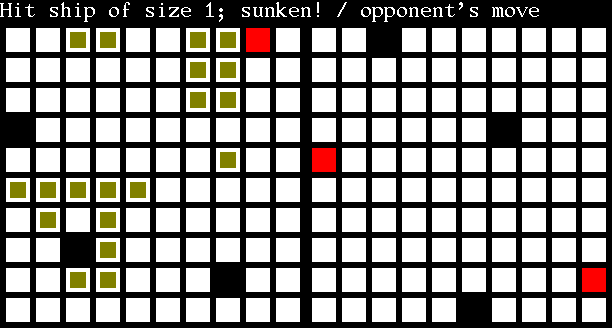

# Battleships



Sieciowa gra w statki dla dwóch osób.

## Kompilacja

### Wymagania
* cmake
* ninja
* clang++
* protobuf

Kompilator Clang jest wymagany ze względu na nieco dojrzalszą implementację modułów C++20 niż w GCC, analogiczną zaletę posiada system kompilacyjny Ninja.

Dodatkowo, dla klienta:
* SDL3
* SDL3_ttf

### Instrukcja

Kompilacja obydwu programów:

```
export C=$(which clang)
export CXX=$(which clang++)
cmake -G "Ninja" -B build
cmake --build build
```

Aby skompilować sam klient lub sam serwer, należy dodatkowo przekazać opcję `-DBUILD_SERVER=OFF` lub `-DBUILD_CLIENT=OFF` do pierwszego polecenia.

## Architektura

Jednowątkowy *serwer* wykorzystuje gniazda nieblokujące i multipleksację wejść za pomocą mechanizmu `kqueue` na systemach ze współczesnej rodziny BSD i macOS oraz `epoll` na Linuksie.

Graficzny *klient* oparty na SDL3 zajmuje się wyłącznie losowym generowaniem plansz i przekazywaniem ruchów gracza do serwera.

Komunikacja odbywa się za pomocą pakietów przygotowywanych do transportu za pomocą systemu Protocol Buffers.

Klient natychmiast po uruchomieniu podejmuje próbę nawiązania połączenia z serwerem. Serwer utrzymuje listę graczy, których może połączyć w pary. Wtedy do obydwu wysyła komunikat oczekiwania na przesłanie planszy, na który klienci odpowiadają. Wówczas rozpoczyna się rozgrywka: jeden z graczy otrzymuje wiadomość wskazującą na jego kolej i wykonuje ruch. Serwer weryfikuje ruch (kolejność, prawidłowość, powtórzenie) i odesławszy komunikat o niepoprawnym ruchu czeka dalej bądź powtarza ruch drugiemu graczowi, obydwu informując o chybieniu albo trafieniu wraz z rozmiarem trafionego okrętu i ewentualną informacją o zatopieniu. Przy okazji celnego strzału serwer sprawdza, czy ruch nie kończy rozgrywki i w razie potrzeby informuje graczy o zwycięstwie lub porażce.

W razie wystąpienia błędu w komunikacji z jednym z graczy serwer przerywa grę.

## Obsługa

Serwer nie przyjmuje żadnych argumentów z linii poleceń. Nasłuchuje na wszystkich adresach IPv6 na porcie 1100.

Klient przyjmuje adres i port jako argumenty wiersza polecenia.
